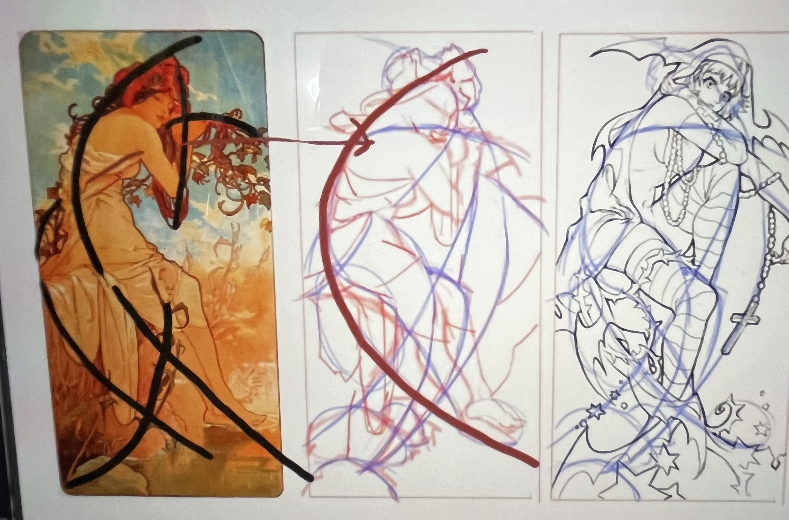

# 目錄
- [L1 飛行道具](#L1-飛行道具)
- [L2 雙主角-淺談與概括](#L2-雙主角-淺談與概括)
- [L3 動態線](#L3-動態線)
- [L4 拆解分組再構成](#L4-拆解分組再構成)
- [L5 節奏與韻律](#L5-節奏與韻律)
- [L6 鷹架](#L6-鷹架)
- [L7 研討](#L7-研討)
- [L8 整合練習](#L8-整合練習)
- [練習方式](#練習方式)

## L1 飛行道具

## L2 雙主角-淺談與概括

## L3 動態線

## L4 拆解分組再構成

## L5 節奏與韻律

### 上課大綱:

- 圖稿:
    - 人物
    - 背景
    - (飛行)道具

- 形狀整理的步驟
    1. 外輪廓簡化 => 只畫圓形、正方形、菱形、長方形
    2. 填洞 + 挖洞 => 再做細節調整
    
  
#### 圖稿

**三的定理:** 
有三個方塊(三角、圓型)，要如何才能顯示出動態，可以讓畫面看起來不會這麼無聊 ?
1. 大中小 (方塊大小要不同 )
2. 錯落 (每個方塊距離、高低要不一樣)
3. 重疊 (方塊和方塊之間可以重疊)     

**畫畫步驟:** 
1. 先畫人物
2. 考慮背景
    1. 先畫三個方塊，要根據三的定理來畫
    2. 填空: 三個方塊內填入物品、背景、道具，例如:天空、花瓶、凳子、飛機、風鈴...等
    3. 可以像俄羅斯套娃一樣，在方塊內再畫三個方塊，一樣照著三的定理，讓背景豐富起來
    4. 畫完後覺得背景太空可以再加上飛行道具(小的物件)，要遵守錯落
    5. 最後透視可以進場，看一下透視是否正確

*補充:錯落手法除了可以讓距離不同，也可以利用物品進行遮擋(貓咪畫在椅子前面、在椅子上面鋪布)，或是根據透視來讓高度不同(近大遠小)*

> **有大概的縱橫錯落後再根據自己的需求修改出合適的穿插**

**大老背景畫畫經驗:**
> 大老在畫圖時，背景大多會有三到四個主要會重複的物體(零件)來做三的定理來讓畫面豐富 
> 其中這兩到三個會重複的物品(基本型)會比較大，例如:岩石、樹，會橫向做重疊，或直向作重疊，去表示錯落，之後可能會小單調，所以會加一些飛行物件(小物件)去做遮擋，例如:葉子、鳥

**範例圖片-鳥山明老師的作品** 

> 大型主要會重複的物體(零件): 樹、雲、山丘 
> 樹: 有直向重疊並且有高低錯落 
> 雲: 橫向重疊，並且長度和大小不一樣 
> 山丘: 有大中小，高度距離也不一樣  
> 飛行物件(小物件): 蘑菇、沙丘、月亮、木星 
> 這些小物件一樣符合三的定理 

#### 形狀整理:

> 先做形狀整理，可以避免誤入細節，畫出太瑣碎的外輪廓

**範例圖片-男鹿和雄老師的作品** 

**臨摹步驟**
> 1. 先把大外框(外輪廓)用CSI給畫出來 
> 2. 再畫內部的細節，用很多個圓去概括內部圖案 
> 3. 細節處理:
>    1. 先做挖洞把外輪廓整理成有凹低起伏  
>    2. 再做填補，把內部陰影的部份用較深顏色的筆給填補起來，做出有凹低起伏的樣子  

#### 問題:

1. 為什麼抓型的時候要反著看圖抓型?
> 因為要打破大腦的認知慣性 
> 例如:手往前會因為透視而變短，但大腦會告訴你不可能那麼短，因此會有誤差，這時候可以試著反抓型 
> 參考書本:《像藝術家一樣思考》（Steal Like an Artist） 
> 左腦: 結構  右腦: 圖形 => 上述為先不管結構先練圖形的技巧

## L6 鷹架

### 上課大綱:

**1. 如何訓練設計: 練習裁切**

**2. 圖形鷹架設計**

#### 1. 裁切(練習設計)

**提煉步驟:**

 步驟一 : 尋找參考圖

 步驟二: 利用CSI把參考物裡面的零件(物件)圖形給切出來

 步驟三 : 選擇要畫的物品(不一定要人可以其他物品)，把物體也做零件(圖形)切割
 
 > 以人舉例可能就有衣服、外套、帽子..等

 > 以滑鼠舉例: 中間滾輪，左右按鍵。底部..等

 步驟四； 把參考圖的零件(圖形)貼付給步驟三要畫的物品，例如花紋、樣式...等 

 > 需要調整比例變化或色彩變化: 花紋變大、形狀變圓...等

 步驟五: 畫完之後再去思考人物姿勢或物品擺設

**練習方法**

 > 依據某個主題或某個世界觀，去設計出角色的服裝、造型和配色
 
 > 例: 下圖電話亭:

 1. 格子部分 -> 外套
 2. 上面屋頂 -> 帽子
 3. 下面招牌文字 -> 肩帶
 4. 裡面黑色部分 -> 衣服

**範例圖片-物品擬人化練習** 

#### 2.圖形鷹架設計

1. 圖形對比 直曲變化

2. 動態變化(動作設計)

   - 橫線:
      - 眼睛
      - 肩膀
      - 腰
      - 膝蓋
   - 直線:
      - 身體
      - 頭
      - 手
      - 腳

> 一個完整的人物設計需要又直曲對比以及動態變化(例:把人物放在D字形或之字形裡)

#### 問題:

1. 為什麼不能出現多種植物，為什麼多種會顯得畫面雜亂，這臨界點要如何區分?

> 畫一幅圖或一個物件應該先考慮圖形，先學會歸類，把物件分成:圓形、半圓、正方形、三角形，例如我要畫的植物先畫半圓形，在這半圓形裡面再去填入不同樣式的植物(盡可能地貼齊邊線)，這樣就不會顯得畫面雜亂

> 一個物件不該有太多其他的圖形，例如植物如果用半圓形去概括，就不該再出現方形或三角形包括的植物，這樣才不會顯得畫面凌亂 

> 一幅畫的最小單位應該是幾何圖形(圓形、正方形、長方形、梯形、三角形...)，而不是裡面物件的形狀

## L7 研討

## L8 整合練習

# 練習方式

- 圖形思考
    - 零件庫的作畫步驟:
        - 1. 先找照片
            - 葉子
            - 花
            - [樹](https://www.youtube.com/watch?v=tk__OByxYkA)
            - 手
            - 手指
            - 手臂
            - 腳掌
        - 2. 邊緣全簡化 => 只畫圓形、正方形、菱形、長方形
        - 3. 填洞 + 挖洞 => 再做細節調整
    - 抽象圖形構成: 利用三的定理(橫向、縱向、小物)的方式，畫出物品擺放的位置
    - 框架拼貼: 把上述的零件填入擺放的位置，加以修改完成一幅圖畫

- 練習方式
    - 樣式 =>以圖形的方式畫出樣式即可，目的是要畫出不同形狀或風格的物品
    - 完稿 =>用CSI練習線條的俐落度並且要區分出主次的線條
    - 趨勢、動態=> 捕捉動態線，無須畫得完整，只要畫出大概的線即可
       - 方法:
        - 先上色塊再用CSI畫線練外輪廓
        - 先做圖形整理，畫出大外框的形狀，再畫細節
        - 用透視的方式做: 先畫地板、拉透視線、畫出整個人    

- 鷹架創作練習步驟:
    - 基礎練習:
        1. 尋找真實圖片
        2. 要先能看出人體動態線(主要趨勢)
        3. 看出後補齊四肢、頭和身體的形狀(圖形)
        4. 形狀(圖形)補完後要加入結構(符合透視)
        5. 最後要把人體肌肉加上去
    - 創作:
        - 力道表演(加強表現、張力的力道)
          - 上半身
            - 生氣: 熊背 -> 誇大背部的彎曲線和拱型，畫得更彎、更大
          - 下半身
            - 腿部: 更加的彎曲
        - 根據真實圖片把圖形提煉後變成卡通化或誇張化，例:天外奇蹟(駝背男主)、海賊王(女帝)...        

> 只畫卡通或Q版的話，基礎練習練到第三步就可以先練創作，練完後可以再回去練基礎練習的第四和第五步驟

> 根據照片或插圖的人物，抓到趨勢或動態線，利用這動態線設計自己的圖

