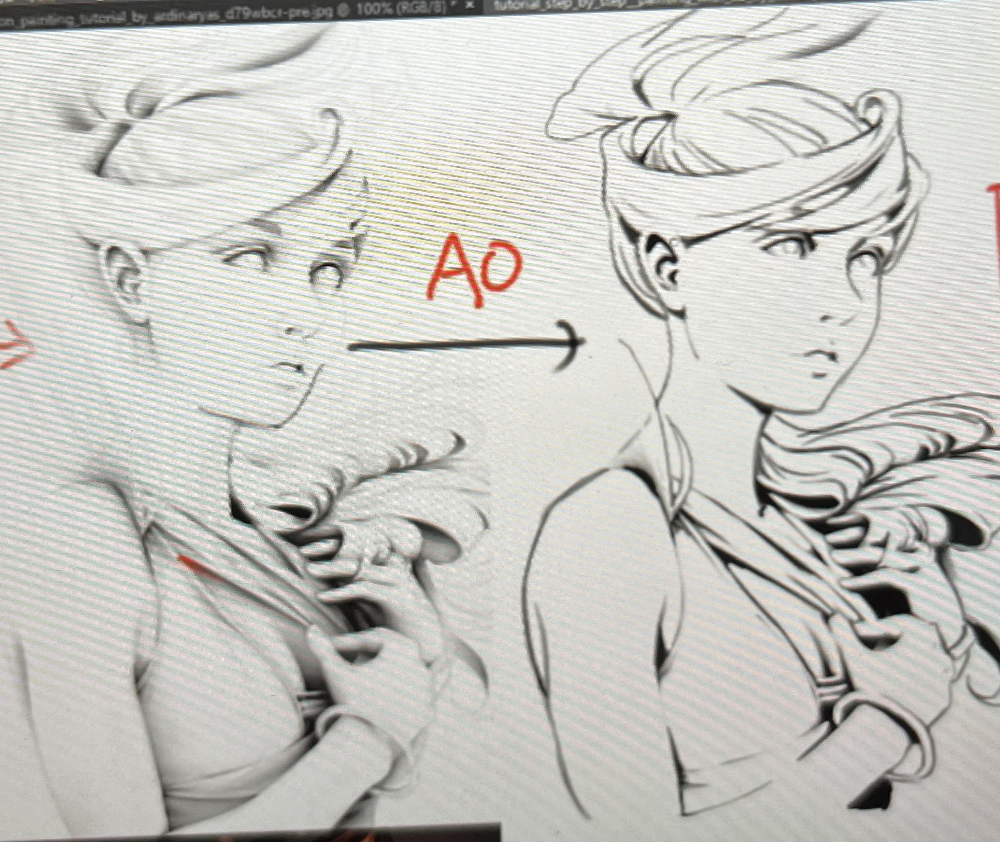
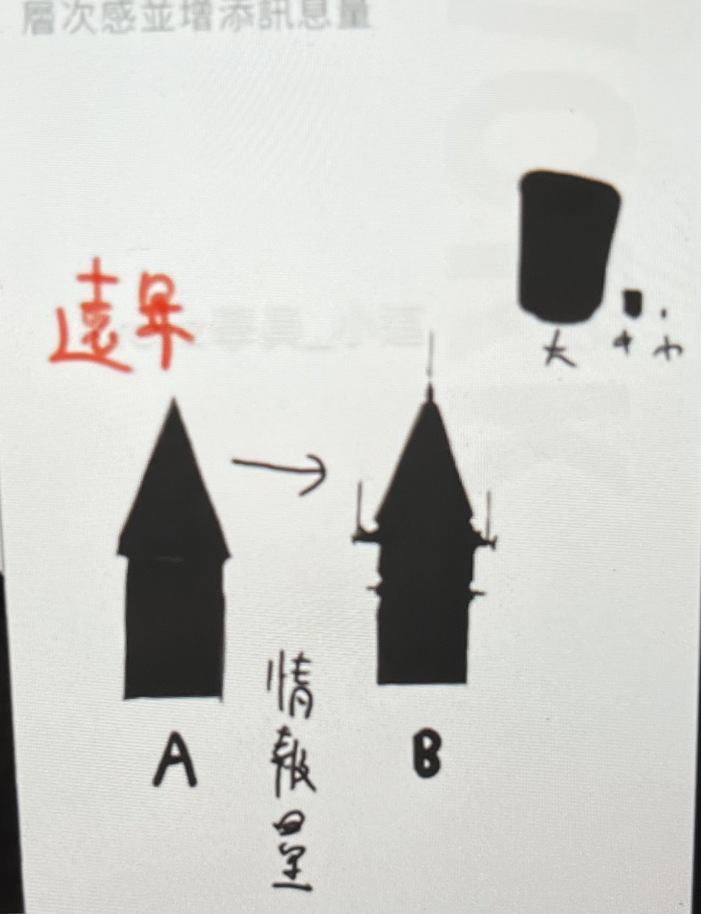
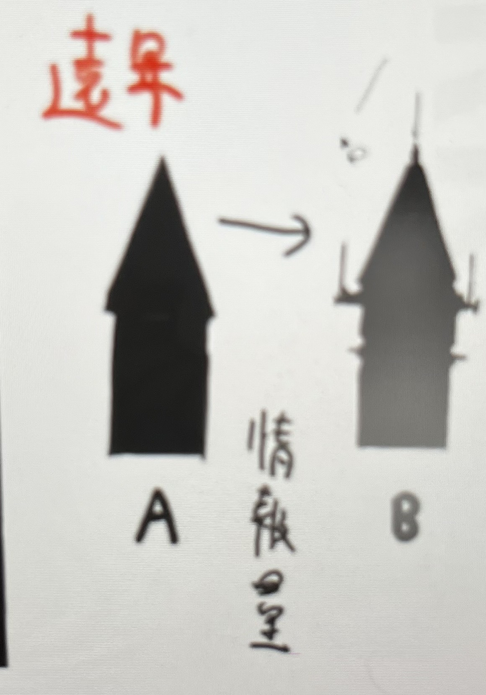
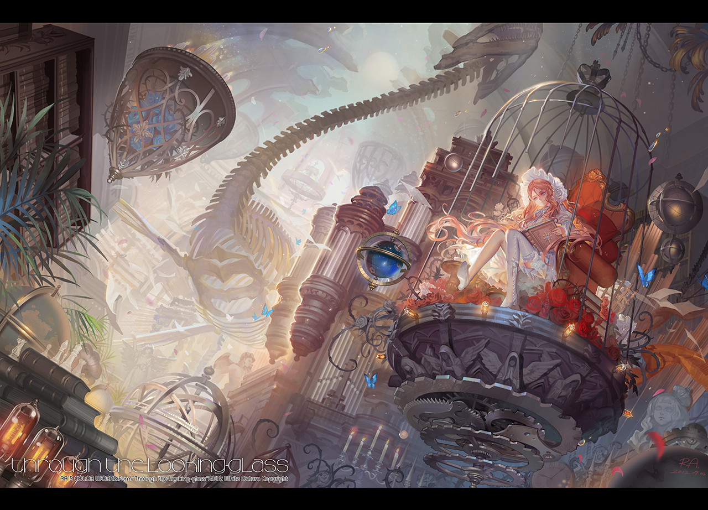
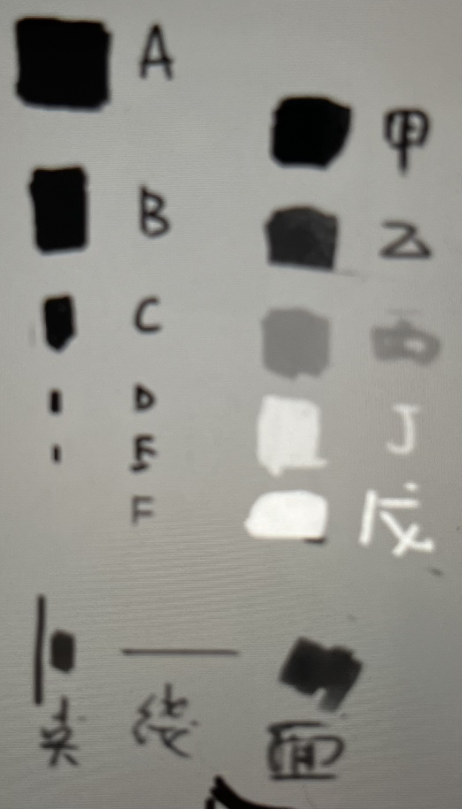

# 目錄
- [L1 課程導覽](#L1-課程導覽)
- [L2 形狀與明暗交界線](#L2-形狀與明暗交界線)
- [L3 調子](#L3-調子)
- [L4 混色](#L4-混色)
- [L5 環境光與固有色](#L5-環境光與固有色)
- [L6 創造畫面層次](#L6-創造畫面層次)
- [L7 不同環境光的物體](#L7-不同環境光的物體)
- [L8 整合練習](#L8-整合練習)

## L1 課程導覽

## L2 形狀與明暗交界線

## L3 調子

## L4 混色

## L5 環境光與固有色

### 上課大綱:

底圖風格 
- 閉塞
- 打光(直色光光色改變)
- 二分

### 閉塞

**閉塞 v.s. 死角**

閉塞: 光在充足的情況下也不容易照到的區域(包含黑影的漸層)

死角: 光進不去變成全黑的位置

> 閉塞會包含死角，死角指的是全黑的位置

**範例圖片-球體光影** 

閉塞: 黑光的位置，漸變也算

死角: 只有蛋底部那最黑的地方

> 畫二次元時死角大多會在畫線稿時加上，有些線搞會有較黑的部分那基本上就是是死角

**範例圖片-米山舞老師的線搞** 

> 背部和頭髮的交接處就有一快特別黑的地方，那就是死角 
> 頭髮的黑面也是死角

**畫法**
1. 先畫線搞(黑線) -> 畫完後填底色
> 缺點: 弱調子會不見 
2. 剪影(灰階)畫法: 先把大致的底色上完，上完後畫死角(沒有把線稿都描完，只有描部分)
3. 先畫線稿(只留外框，可調較淺的顏色) -> 畫完後畫死角(內部細節、外框都畫) -> 填底色
> 線搞顏色選擇，可以是底色的往右下偏一階

#### 打光(直色光光色改變)

**原先作法**
- 底圖畫好
    - 做二分(畫明暗交界線的形狀)
      - 缺點: 無法直接調整亮面顏色，會影響到底圖
      - 解決方法: 把亮部選起來-> CTR+U(調整彩度、明度、色相)或 CTR+B(調整顏色)
    - 遮色片上暗面 ->加亮顏色(變亮)->畫光上去
      - 改變亮面顏色:直接調整上面加亮圖層的彩度即可
      - 缺點: 加亮的顏色會受的底圖顏色的影響(不好調整極端狀況，偏藍或偏紅的光)

> 建議暗面、亮面、反光要分開圖層，這樣會比較好調整或改變顏色

**[新的做法的步驟:](https://youtu.be/-Bw5fFR2RmQ)**

1. 底圖畫好
2. 根據底圖使用遮色片開新的圖層，在遮色片的圖層做二分，把暗面畫出來
3. 再開新的圖層，關閉所有圖層，用油漆桶倒入亮光顏色後，使用**下一圖層剪裁**功能，讓顏色不會跑出去
> 這圖層要在底圖上方，不能在暗面圖層上方
4. 選取暗面圖層，之後點擊亮面圖層，用DELETE刪除，讓亮面圖層不包含暗面，只留下亮面
5. 再讓兩個圖層做細部調整(CTR+U(調整彩度、明度、色相)或 CTR+B(調整顏色)
或是色彩增值，柔光...等)

#### 二分

> 頭髮可以研究黏土人，看黏土人的二分怎麼畫

基礎: 清楚畫物品的結構，可以從包線開始練(需畫出物體的線條走向)，之後再去畫二分

**範例圖片-線條走向的範例** 

## L6 創造畫面層次

### 上課大綱:

1. 死角 v.s. 閉塞 => AO畫法(3D術語:環境光遮蔽[Ambient Occulusion])
   - 場景
   - 人物

2. 空氣

### 死角 v.s. 閉塞

**AO畫法: 在四周光源充足的情況下，有哪些地方會因為旁邊有東西而產生遮蔽，因此會變比較暗**

> 效用: 素描或渲染(Render)可以用默寫的 => 不管環境光怎麼變，死角和閉塞的地方一定會比較暗

**範例圖片-AO畫法** 

> AO(環境光遮蔽) = 閉塞陰影

> 死角 = 光進不去全黑的地方  

**範例圖片-AO線搞畫法** 

> 漸變不畫但死角要畫(塗黑)

#### 步驟

**原本步驟:**

1. 底圖階段
  1. 畫死角塗黑
  2. 畫線搞
  3. 固有色(不一定要底圖上)
2. 上光影
  1. 壓暗環境
  2. 打直射光

**AO畫法:**

1. 底圖階段
  1. 畫死角塗黑
  2. 微妙的漸變(閉塞) ->不能畫線搞
  3. 固有色(不一定要底圖上)
2. 上光影
  1. 壓暗環境
  2. 打直射光

> 重點:
  1. 先找出在環境充足的情況下，閉塞和死角的地方
  2. 當直射光打下來時，最明顯的明暗交界會在哪裡 => 就可以知道暗部裡面那些地方會更暗

  => AO畫法就是閉塞/死角和二分的結合 

### 空氣

> 大多是在處理中遠景，想畫細節但又不能畫太多時

1. 在輪廓(剪影)上面下功夫，增加情報量

2. 在黑白的世界當中，畫空氣 => 用噴槍筆刷加漸變上去，在遠處看起來就好像有霧氣

3. 在和近景的交接處可以上比較濃的噴槍筆觸把遠景的東西推開

**範例圖片-空氣**

### 水彩素描

**要在有限制的情況下去畫**

 - 筆刷大小(六種，從大到無)
 - 明度(五種，黑到白)
 - 用的筆法
   - 點
   - 線
   - 面

**步驟**

1. 找尋一般照片(需環境光充足)，把對比度調高(明度轉為0)，變成二分(黑白)

2. 先簡單的畫線搞標記一下(無須畫得很精緻、準確，只需畫外輪廓)

3. 快速畫內部塊狀細節 (模仿他的疏密關係，但不要模仿疏密位置)
  - 用大筆刷畫(面):先畫大塊色塊，不要畫細節: 有黑的地方大概就塗一下
  - 用小的筆刷畫(線、面):感覺有細節的過程，較小的黑色、白色，色塊
  - 用更小的筆刷畫出輪廓形狀(線) 

4. 將照片轉回灰階

5. 把灰色暗面給畫好(一樣大色區塊先畫，重複第三步驟)

6. 在亮部固有色的訊息，也可以修整暗部裡面的細節(有些不是全黑)

> 屋頂瓦片不用全部畫出來，要利用完型技巧，只畫厚度(陰影)的部分

7. 練完灰階後，可以回到步驟三，把照片恢復到原本的顏色

8. 卻選擇和照片相似的顏色，利用遮罩等功能開始上色，臨摹成原本的圖片

## L7 不同環境光的物體

### 上課大綱:

1. 畫法
  - 速圖(鬆)
  - 精緻(緊)

- 考古題
  - 臨摹
    - 步驟:要能用在創作中
- 分析能力
- 工具

#### 考古題

> 在臨摹的時候要跟創作的步驟一樣

步驟1: 先畫大致的線搞(不須畫得太精細)

步驟2: 把照片變二分，先畫出二分出來
> 這步驟是練形狀切割

1. 黑白練習

步驟3: 把照片變回灰階，試著臨摹出灰階的調子(這裡要注意:筆觸、筆壓、筆刷種類、筆刷大小...等)
> 這步驟是練調子(筆觸)

=> 調子也是可以分大、中、小來練，先畫大的調子再往小的調子修

2. 色彩練習

步驟3: 把照片變回原來圖片，試著臨摹出色彩的調子(這裡要注意:筆觸、筆壓、筆刷種類、筆刷大小...等)
  - 先用滴管畫完大塊區域(直射光顏色、暗部顏色) => 進階練習: 不吸色靠眼睛去抓色(注意:灰階和顏色明亮)(調整HSV)
  - 再去調整細部的調子 (筆觸、藏色)
=> 色彩練習要把形狀更色彩分開練習，練習效果才會快!!

#### 分析能力

1. 光色

步驟一: 找一張完整的照片

步驟二: 分析這張照片的直射光和暗部的顏色

步驟三: 應用到你的畫裡面

**注意:這是找光色不是找配色!!!**

> 所以只要找直射光和暗部的顏色

2. 明暗交界線

步驟一: 找到上面的光色後，再來判斷明暗交界線

步驟二: 跟著畫出的明暗交界線，畫出暗部的形狀

步驟三: 畫出形狀後再用光色的直射光和暗部的顏色上色

> 亮部為直射光顏色，暗部為暗部的顏色

##### 在練習的時候可以用表格的形式化，上面那標頭的row放明暗交界線，而最左邊的column則放光色對照圖，來完成一個完整的圖

## L8 整合練習